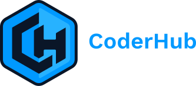

<p align="center"><picture><source media="(prefers-color-scheme: dark)" srcset="docs/wordmark-dark.svg"></picture></p>

<p align="center">
  <strong>Tu búsqueda laboral, con IA, en tu máquina.</strong><br>
  Te dice qué ofertas son reales, cuáles te matchean y qué hacer con cada una. <strong>Nunca se postula por vos.</strong>
</p>

<p align="center"><sub>Parte de la mentoría <a href="https://arielmirra.com/vsl">CoderHub</a>. Novedades y tips en <a href="https://www.instagram.com/ariel.mirra/">Instagram</a>.</sub></p>

## Qué hace por vos

Pegás una oferta. Te dice si vale la pena.

- **Es falsa o vieja?** Detecta ghost jobs y estafas antes de que escribas una palabra.
- **Es para vos?** Puntúa el rol contra tu CV real y te avisa si el fit es flojo. Podés ignorarlo.
- **Vale la pena?** Arma el CV, la cover letter y las respuestas. Vos las leés. Vos las mandás.
- **A quién le escribo?** Encuentra a la persona y te deja el mensaje listo. Nunca lo manda.
- **Dónde queda todo?** Cada postulación queda en tu máquina. No se sube nada a ningún servidor nuestro.
- **Qué me falta aprender?** Después de varios "no", te dice cuál es el gap.

Las primeras corridas son medio crudas: todavía no te conoce. Hablale. Tu CV, qué buscás, qué no aceptás. La primera vez que lo abrís te pide todo eso por chat. No hay nada que configurar a mano.

## Qué no hace

- **Postularse solo.** Te arma la respuesta de cada campo; vos revisás y hacés clic en Submit. El script nunca hace el POST (`prepare-application.mjs`).
- **Mandar emails.** Solo borradores. No hay forma de enviar mails en todo el código.
- **Mandar tus datos a ningún lado.** Sin telemetría ni backend propio. Tu CV va de tu máquina al proveedor de IA que elegiste, y a ningún otro lado.
- **Empujarte a postularte debajo de 4.0/5.** Te va a decir que no. Podés hacerlo igual, y te lo va a marcar.

Reformula tu CV; nunca tiene que inventarlo. Hoy esa regla vive en los prompts, todavía no en un chequeo de código. Leé cada CV antes de mandarlo.

## Funciones

| Función                  | Qué hace                                                                                                                                 |
| ------------------------ | ---------------------------------------------------------------------------------------------------------------------------------------- |
| **Evaluación A-H**       | Resumen del rol, match con tu CV (cuánto pesa cada requisito en esa oferta y de dónde sale ese peso), estrategia de seniority, research de sueldo, personalización y prep de entrevista (STAR+R). Suma un chequeo de legitimidad (bloque G) que marca estafas y ghost jobs, y una señal de permiso de trabajo que marca como bloqueante una oferta que dice explícitamente que no da sponsorship |
| **Human-in-the-Loop**    | AI evaluates and recommends, you decide and act. The system never submits an application -- you always have the final call <!-- hitl: absolute guarantee. Do not add "automatically", "by itself", "without your permission" or any other hedge when translating this row. -->               |
| **CV en PDF para ATS**   | CV adaptado a cada oferta, con las keywords del puesto                                                                                   |
| **Cover letters**        | Basadas en research de la empresa, con las keywords de la oferta y tu OK en el chat antes de generar el PDF                              |
| **Más allá del CV**      | Research de la empresa (`deep`), búsqueda del hiring manager o recruiter con el mensaje de LinkedIn listo (`contacto`) y borradores de email de postulación (`email`), sin enviar nada |
| **Patrones**             | Patrones de rechazo, tasa de avance por canal, embudo completo y detección de ofertas republicadas                                       |
| **Scanner de portales**  | 100+ empresas precargadas y búsquedas en Ashby, Greenhouse, Lever, Wellfound y más                                                      |
| **Seguimiento**          | Tracker de postulaciones, cadencia de follow-ups y clasificación de respuestas de las empresas                                          |
| **Entrevistas y ofertas** | Plan de preparación, práctica con feedback, debrief post-entrevista, lectura de contratos y análisis de sueldo                        |

## Instalación

Necesitás [git](https://git-scm.com), [Node.js](https://nodejs.org) 22.5 o más nuevo y [Claude Code](https://claude.com/claude-code) (o OpenCode, Codex u otro CLI de IA).

1. Aceptá la invitación al repo que te llegó por GitHub.
2. Clonalo y abrilo con tu CLI:

   ```bash
   git clone https://github.com/coderhub-os/<tu-repo>.git
   cd <tu-repo>
   claude
   ```

3. Escribí `/coderhub`.

La primera vez te guía por todo: instala lo que falte (`npm install`, Chromium para los PDFs), te pide tu CV y arma tu perfil charlando. Si algo falla, corré `npm run doctor`: te dice qué falta.

> **El sistema se personaliza con tu propio CLI.** Modos, arquetipos, pesos del scoring, guiones de negociación: pedile que los cambie. Lee los mismos archivos que usa, así que sabe qué tocar.

## Uso

En los CLIs que registran slash commands (Claude Code, OpenCode, Cursor, Qwen y otros):

```
/coderhub             → Menú con todos los comandos
/coderhub {oferta}    → Pipeline completo: evaluación + reporte + PDF + tracker (pegá el texto o la URL)
/coderhub pipeline    → Procesa las URLs pendientes de data/pipeline.md
/coderhub oferta      → Solo la evaluación, bloques A a H (sin PDF)
/coderhub ofertas     → Compara y rankea varias ofertas
/coderhub contacto    → Encuentra a quién escribirle y te arma el mensaje
/coderhub deep        → Research a fondo de la empresa
/coderhub interview-prep → Prep de entrevista para esa empresa
/coderhub pdf         → Solo el CV en PDF, optimizado para ATS
/coderhub cover       → Cover letter
/coderhub email       → Borrador de email de postulación (nunca lo manda)
/coderhub apply       → Te ayuda a completar el formulario (el Submit lo hacés vos)
/coderhub scan        → Busca ofertas nuevas en los portales
/coderhub tracker     → Estado de tus postulaciones
/coderhub followup    → Follow-ups vencidos y borradores
/coderhub patterns    → Por qué te rechazan y cómo ajustar el target
/coderhub offer-prep  → Lectura de una oferta o contrato que te llegó (no es asesoramiento legal)
/coderhub update      → Actualiza CoderHub OS con vista previa de los cambios
```

`/coderhub` solo te muestra el menú completo. También podés pegar la URL o el texto de una oferta directo: lo detecta y corre el pipeline.

### Codex

En Codex los slash commands no están garantizados. Pedí el modo en lenguaje natural (plain language), en el prompt:

```text
Evaluá esta oferta con el auto-pipeline: https://empresa.com/jobs/123
Corré el modo scan y resumime las ofertas nuevas.
Corré el modo tracker y resumime el estado de mis postulaciones.
```

O sin abrir una sesión, con `codex exec`:

```bash
codex exec "Corré el modo scan y resumime las ofertas nuevas."
```

La guía completa de Codex (en inglés) está en `docs/CODEX.md`.

## Cómo funciona

```
Pegás la URL o el texto de una oferta
        │
        ▼
┌──────────────────┐
│  Detección de    │  Clasifica el tipo de rol
│  arquetipo       │
└────────┬─────────┘
         │
┌────────▼─────────┐
│  Evaluación A-H  │  Match, gaps, sueldo, historias STAR, legitimidad
│  (lee cv.md)     │
└────────┬─────────┘
         │
    ┌────┼────┐
    ▼    ▼    ▼
 Reporte PDF Tracker
   .md  .pdf
```

## Dashboard

Un panel en la terminal para recorrer tu pipeline:

```bash
npm run serve:dashboard
```

## Tus datos

Tu CV (`cv.md`), tu perfil (`config/profile.yml`), el tracker (`data/`), los reportes (`reports/`) y los PDFs (`output/`) son tuyos. `/coderhub update` nunca los toca: solo actualiza los archivos del sistema, y antes te muestra qué cambia.

## Aviso

**CoderHub OS es una herramienta local, no un servicio online.** Al usarla, aceptás que:

1. **Tus datos son tuyos.** Tu CV y tus datos quedan en tu máquina y van directo al proveedor de IA que elijas (Anthropic, OpenAI, etc.). No los recolectamos ni tenemos acceso.
2. **La IA la controlás vos.** Los prompts le indican que nunca se postule por vos, pero los modelos pueden fallar. Revisá todo lo que genera antes de mandarlo.
3. **Respetás los términos de cada portal** (Greenhouse, Lever, Workday, LinkedIn, etc.). No lo uses para spamear empresas.
4. **No hay garantías.** Las evaluaciones son recomendaciones. Los modelos pueden inventar skills o experiencia.

## Licencia

Código bajo licencia [MIT](LICENSE).
